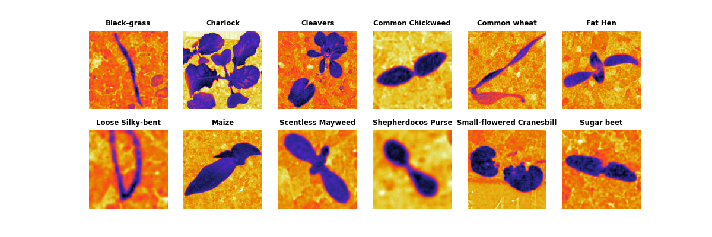

<h1 align="center"> Plant Seedlings Project </h1>
</img>

**Table des matières :**

- [Introduction](#section-1)
  - [Objectifs du pojet](#sous-section-11)
  - [Présentation du jeu de données](#sous-section-12)
- [Analyse exploratoire des données (EDA)](#section-2)
  - [Visualisation des images de différentes classes](#sous-section-20)
  - [Pixelisation & Répartition des classes](#sous-section-21)
  - [Statistiques descriptives sur les données](#sous-section-22)
  - [Distribution des tailles d'images](#sous-section-23)
  - [Ratio H/L & Canaux RGBA](#sous-section-24)
  - [Histogrammes de Couleurs](#sous-section-25)
- [Prétraitement des données](#section-3)
  - [Redimensionnement des images](#sous-section-31)
  - [Normalisation des valeurs de pixel](#sous-section-32)
  - [Segmentation sémantique de l'image](#sous-section-33)
  - [Augmentation de données](#sous-section-34)
  - [Création des ensembles d'entraînement, de validation et de test](#sous-section-35)
- [Construction et entraînement du modèle](#section-4)
  - [Sélection de l'architecture du modèle](#sous-section-41)
  - [Mise en place du modèle](#sous-section-42)
  - [Configuration de l'entraînement (hyperparamètres, fonction de perte, optimiseur)](#sous-section-43)
  - [Entraînement du modèle sur les données](#sous-section-44)
- [Évaluation du modèle](#section-5)
  - [Évaluation des performances du modèle](#sous-section-51)
  - [Mesures des metriques](#sous-section-52)
  - [Matrice de confusion](#sous-section-53)
  - [Courbes ROC (le cas échéant)](#sous-section-54)
  - [Analyse des erreurs de classification](#sous-section-54)
- [Amélioration du modèle](#section-6)
  - [Réglage des hyperparamètres](#sous-section-61)
  - [Utilisation de modèles pré-entraînés (transfer learning)](#sous-section-62)
  - [Entraînement sur des données supplémentaires (le cas échéant)](#sous-section-63)
  - [Réévaluation des performances après les améliorations.](#sous-section-64)
- [Visualisation des résultats](#section-7)
  - [Visualisation des prédictions du modèle sur de nouvelles images](#sous-section-71)
- [Conclusion](#section-8)
  - [Récapitulation des résultats et des conclusions](#sous-section-81)
  - [Possibilités d'extensions ou de travaux futurs](#sous-section-82)
- [Références](#section-9)
  
## <a name="section-1"></a>[Introduction](#section-1) 

<p align="left">Les plantes jouent un rôle vital dans notre environnement et notre quotidien. Elles fournissent de la nourriture, de l'oxygène, et contribuent à la beauté de notre monde naturel. Cependant, la classification et la reconnaissance des différentes espèces de plantes peuvent s'avérer être un défi complexe pour les biologistes  et les chercheurs en sciences de l'environnement et naturel. C'est là que l'apprentissage automatique, l'apprentissage profond et la vision par ordinateur interviennent pour nous aider à résoudre ce problème si complexe. </p>

Le jeu de données [Kaggle V2 Plant Seedlings Dataset](https://www.kaggle.com/datasets/vbookshelf/v2-plant-seedlings-dataset) offre une opportunité passionnante d'exploration et de comprendre la diversité des plantes à travers une approche informatique basé sur du **deep learning**. Composé d'une collection d'images de semis de plantes appartenant à différentes espèces, ce jeu de données représente un défi majeur et intéressant pour la classification automatisée des plantes. En utilisant des techniques de deep learning avancées(CNN, RCNN etc..) et de traitement d'images (Segmentation d'image), nous pouvons développer un modèle qui sera capable de reconnaître et de classer les plantes en fonction de leurs caractéristiques visuelles(nombre de feuilles, croissance, etc..), détecter également les possibles maladies pouvant attaquer ces dernières. 

### <a name="sous-section-11"></a>[Ojectifs du projet](#sous-section-11)
<p align="left"> L'objectif principal de ce projet est de créer un modèle de deep learning de classification d'images capable de distinguer efficacement avec une très bonne précision entre les différentes espèces de plantes présentes dans le jeu de données. Pour ce faire, nous allons explorer les images, prétraiter les données, construire un modèle d'apprentissage profond, l'entraîner sur un ensemble de données d'entraînement et évaluer ses performances sur un ensemble de données de test et validation. Tout au long de ce projet, nous allons également mettre l'accent sur l'analyse des résultats pour mieux comprendre les performances du modèle et identifier les défis spécifiques posés par la classification des plantes et voir comment améliorer notre modèle de DL. </p>

<p align="left">Ce projet ne se limite pas seulement à la création d'un modèle de classification, mais il offre également une opportunité d'exploration visuelle des données, de compréhension des techniques d'augmentation de données et d'analyse des erreurs de classification. En fin de compte, notre objectif secondaire sera d'utiliser les capacités de l'apprentissage profond pour contribuer à la recherche en botanique et à la préservation de la biodiversité en identifiant automatiquement les espèces de plantes à partir d'images.</p>

<p align="left">Dans les sections suivantes, nous allons plonger plus profondément dans les détails du jeu de données, de l'exploration des données à la construction de notre modèle, en passant par l'évaluation des performances de ce dernier à travers plusieurs métriques. Nous espérons que ce projet servira de base pour d'autres applications de classification d'images dans le domaine de la botanique et de la biologie.</p>

### <a name="sous-section-12"></a>[Présentation du jeu de données](#sous-section-12)

Le jeu de données [Kaggle V2 Plant Seedlings Dataset](https://www.kaggle.com/datasets/vbookshelf/v2-plant-seedlings-dataset) est un ensemble de données couramment utilisé dans le domaine de la vision par ordinateur [1](https://www.kaggle.com/code/allunia/computer-vision-with-seedlings/notebook) et de l'apprentissage automatique pour la classification d'images de plantes [2](https://www.researchgate.net/publication/332677611_An_Improved_Deep_Neural_Network_for_Classification_of_Plant_Seedling_Images). Ce jeu de données est hébergé sur la plateforme [Kaggle](https://www.kaggle.com/), qui est une communauté de data scientists et de chercheurs en science des données.

Comme décrit plus haut dans la section <a name="section-11"></a>[Ojectifs du projet](#sous-section-11), l'objectif principal de ce jeu de données est de permettre la classification automatique des semis de plantes en fonction de leur espèce. Il s'agit d'une tâche de classification multi-classe, où chaque image est étiquetée avec l'espèce de plante correspondante.

Le jeu de données comprend les éléments suivants :

> [Images]() : Le jeu de données contient un ensemble d'images en couleur(**RGB** ou **RGBA**) représentant des semis de plantes. Chaque image est associée à une étiquette qui indique l'espèce de la plante.

> [Classes]() : Il existe plusieurs classes d'espèces de plantes dans ce jeu de données. Chaque classe correspond à une espèce spécifique de plante. Parmi les espèces incluses, on trouve des plantes telles que le maïs, le pissenlit, le chénopode, la renouée, la moutarde sauvage, et d'autres *voir tableau ci-dessous*.

> [Taille du Jeu de Données]() : Le jeu de données contient un nombre significatif d'images(**5539**), avec plusieurs centaines d'images pour chaque classe. Cependant La taille totale du jeu de données peut varier en fonction de la version spécifique que vous utilisez. Ici c'est la version **V2 du dataset**.

| __Noms d'espèces__                    | __Nombre de plantes par espèce__ | __RGBA (RGB + canal alpha)__  |__[Total]()__|
|---------------------------------------|----------------------------------|-----------------------------|------|
| __Black-grass__                       | __309__               | __3__|
| __Charlock__                          | __452__               | __0__|
| __Cleavers__                          | __335__               | __0__|
| __Common Chickweed__                  | __713__               | __0__|
| __Common wheat__                      | __253__               | __0__|
| __Fat Hen__                           | __538__               | __0__|
| __Loose Silky-bent__                  | __762__               | __21__|
| __Maize__                             | __257__               | __0__|
| __Scentless Mayweed__                 | __607__               | __0__|
| __Shepherdoco Purse__                 | __274__               | __0__|
| __Small-flowered Cranesbill__         | __576__               | __0__|
| __Sugar beet__                        | __463__               | __0__|
|  __[Total]()__                        | __[5539]()__                     | __[24]()__      |__[12 espèces]()__|

- Valeurs Statistiques

|__Min__        | __Max__     | __Mean__         | __Med__        | __std__       | __Q1__         | __Q3__       | __IQ__        |
|---------------|-------------|------------------|----------------|---------------|----------------|--------------|---------------|
|  __[253]()__  | __[762]()__ | __[462.6]()__    | __[457.5]()__  | __[179.3]()__ | __[300.3]()__  |__[583.8]()__ | __[283.5]()__ |


## <a name="section-2"></a>[Analyse exploratoire des données (EDA)](#section-2)
### <a name="sous-section-20"></a>[Visualisation des images de différentes classes](#sous-section-20)
#### Espace colorimétrique RGB (Red, Green, Blue) :


L'espace RGB est basé sur les trois canaux de couleur primaires, à savoir le **rouge (R), le vert (G) et le bleu (B)**. Chaque pixel d'une image est représenté par une combinaison de ces trois canaux, ce qui permet de reproduire une large gamme de couleurs.
L'espace RGB est couramment utilisé dans le traitement d'images et la vision par ordinateur [REF. 6](https://openaccess.thecvf.com/content_eccv_2018_workshops/w31/html/Hesse_Computer_Vision_for_Medical_Infant_Motion_Analysis_State_of_the_ECCVW_2018_paper.html). Il est adapté à de nombreuses tâches, y compris la classification d'images, la détection d'objets, la segmentation sémantique d'images   [REF. 5](https://towardsdatascience.com/semantic-segmentation-popular-architectures-dff0a75f39d0), [REF. 4](https://nanonets.com/blog/semantic-image-segmentation-2020/).
Il est intuitif, largement utilisé et convient bien à de nombreuses applications de la vision par ordinateur [REF. 6](https://openaccess.thecvf.com/content_eccv_2018_workshops/w31/html/Hesse_Computer_Vision_for_Medical_Infant_Motion_Analysis_State_of_the_ECCVW_2018_paper.html), [REF. 7](https://www.sciencedirect.com/science/article/abs/pii/S0168169919313249).

#### Espace colorimétrique BGR2-LAB  :

L'espace LAB est un espace colorimétrique qui est conçu pour être perceptuellement uniforme, ce qui signifie que les distances entre les couleurs dans cet espace sont plus cohérentes avec la perception humaine de la couleur que dans l'espace RGB.
L'espace LAB est souvent utilisé pour des tâches où la perception de la couleur par l'œil humain est importante. Il est fréquemment utilisé en imagerie médicale, en conception graphique et en analyse de la couleur.
Il est adapté à des tâches où la précision de la correspondance des couleurs est cruciale. L'espace LAB est indépendant du périphérique, ce qui signifie qu'il est moins sensible aux variations de couleur dues aux différents écrans et appareils.

L'utilisation de deux espaces colorimétriques (RGB et LAB) peut être intéressante pour explorer différentes approches de prétraitement des images et évaluer comment ces espaces affectent les performances de votre modèle.  Nous allons voir comment l'utilisation de l'espace BGR2-LAB 
peut faciliter la segmentation sémantique de l'image, et débruité une image avec une éfficacité redoutable.

### <a name="sous-section-21"></a>[Pixelisations & Répartition des classes](#sous-section-21)


Les deux graphiques ci-dessus présentent la répartition du nombre de pixels et du nombre de plantes par espèce. De ces graphiques, deux observations importantes se dégagent :

> Étant donné que la taille d'un pixel est définie comme $pixel = (largeur * hauteur)$, on constate une concentration des valeurs autour de l'intervalle [0.1, 0.4] mega pixels, indiquant une certaine hétérogénéité dans les données, ainsi que la présence de quelques valeurs aberrantes donc la plus grande valeur est de 3.6 Mega Pixels. 

> On remarque également que le nombre d'exemplaires varie d'une espèce à l'autre, ce qui se reflète par une disparité significative dans l'histogramme en barres. Cette disparité démontre que les données ne sont pas distribuées uniformément dans ce dataset. En effet, nous avons des classes dominantes possédant 2 à 3 fois plus de valeurs que les classes minoritaires. Cette disparité peut poser des défis importants lors de la construction et de l'entraînement d'un modèle de deep learning, car il peut avoir tendance à être biaisé en faveur des classes majoritaires, négligeant ainsi les classes minoritaires. Dans le cas des données tabulaires, des techniques d'équilibrage des données, telles que la sur-échantillonnage (oversampling) des classes minoritaires ou la sous-échantillonnage (undersampling) des classes majoritaires, peuvent être nécessaires pour garantir que le modèle apprend efficacement à discriminer toutes les classes avec une précision équilibrée. Dans ce cas précis il est évident que le data augmentation sera au centre de ce processus pour obtenir un équilibre entre les classes.

Afin d'atteindre l'objectif d'une taille d'échantillonnage uniforme, la normalisation des données est cruciale. La data augmentation joue un rôle fondamental dans ce processus. En utilisant des techniques de data augmentation telles que la rotation, le redimensionnement et le recadrage, changement léger de pixels, nous pouvons générer des versions modifiées des images existantes, les rendant cohérentes en termes de taille. Cela permet non seulement d'améliorer la qualité et la diversité du jeu de données, mais aussi d'augmenter la robustesse du modèle de **deep learning** en l'entraînant sur une variété d'angles et de perspectives des données. Ainsi, un modèle formé sur un jeu de données normalisé et augmenté est plus susceptible de généraliser correctement lorsqu'il est confronté à de nouvelles données.

### <a name="sous-section-23"></a>[Distribution des tailles d'images](#sous-section-23)


Les deux premiers graphiques ci-dessus présentent la répartition des hauteurs et des largeurs des images de différentes espèces de plantes. De ces graphiques, trois observations importantes émergent :

> Hauteur et largeur similaires : À une exception près, la hauteur et la largeur présentent des variations similaires, suggérant ainsi que la largeur est approximativement égale à la hauteur pour la plupart des images du dataset. En notant n_H et n_W comme les hauteurs et largeurs de chaque image, cela peut être exprimé comme (m, n_H, n_W, n_C) ≈ (m, n_H, n_H, n_C).

> Variabilité des dimensions : Les images du dataset ne présentent pas toutes les mêmes dimensions. Par conséquent, il est nécessaire de les redimensionner à la même taille avant d'entreprendre toute opération de modélisation.

> Choix de la taille de redimensionnement : Les données montrent une concentration autour de [90, 250], avec des pics plus marqués. C'est à ce stade qu'il est crucial de décider de la taille de redimensionnement. Dans ce contexte, une taille de redimensionnement de (160, 160) a été choisie. Cependant, plusieurs versions du dataset seront générées avec des tailles de redimensionnement différentes afin d'obtenir des données de qualité ainsi qu'une variété de données de qualité.

La diversité des tailles d'images peut poser des défis pour le traitement numérique, car de nombreuses opérations de modélisation nécessitent des images de taille uniforme. Ainsi, le redimensionnement des images pour les adapter à une taille commune, telle que (160, 160, 3), est essentiel pour garantir la cohérence dans l'ensemble du dataset.

Cependant, il est important de noter que différentes tailles de redimensionnement peuvent être utilisées en fonction des besoins spécifiques de l'application. Par exemple, une taille plus petite peut être privilégiée pour une meilleure vitesse de traitement, tandis qu'une taille plus grande peut être préférable pour une qualité visuelle supérieure.

En fin de compte, le choix de la taille de redimensionnement dépend des compromis entre la qualité, la vitesse et les ressources disponibles. Il est également judicieux de générer plusieurs versions du dataset avec différentes tailles de redimensionnement pour répondre à diverses exigences d'analyse et d'apprentissage profond.


### <a name="sous-section-24"></a>[Ratio H/L & Canaux RGBA](#sous-section-24)


Les deux graphiques ci-dessus présentent la répartition du rapport *Largeur/Hauteur* et du nombre de canaux **RGBA** présents dans chaque espèce de plantes ([voir également ces valeurs dans le tableau plus haut]()). De ces graphiques, deux observations importantes se dégagent :

> Le premier graphique confirme ce qui a été mentionné précédemment, à savoir que la grande majorité des images ont une relation *n_W ≈ n_H*. Cependant, ce n'est pas le cas pour toutes les images et espèces. C'est pourquoi il est impératif de redimensionner toutes les images à une taille fixe où *n_H = n_W* pour garantir des dimensions uniformes pour toutes les images, quelle que soit l'espèce de plantes.

> Nous constatons que les images de chaque espèce ne sont pas toutes au format **RGB**. Certaines sont au format **RGBA=RGB+alpha**, ce qui pose un problème pour assurer une cohérence dans la représentation des couleurs. Il est donc nécessaire de retirer le canal *alpha* pour passer de **RGBA** à **RGB**.

En ce qui concerne la première observation, il est essentiel de garantir que toutes les images, indépendamment de leur espèce, aient des dimensions égales. Cela permet une manipulation uniforme lors du traitement numérique et de la formation de modèles d'apprentissage profond.

Quant à la deuxième observation, la présence des canaux *alpha* dans certaines images peut créer une incohérence dans la représentation des couleurs, car ces canaux *alpha* correspondent à la transparence des pixels, ce qui n'est généralement pas nécessaire dans le contexte du traitement d'images de plantes. Par conséquent, il est recommandé de retirer ce canal pour toutes les images, passant ainsi au bon format **RGB**.

En effectuant ces transformations préliminaires sur les données, nous nous assurons que les images sont prêtes à être utilisées de manière efficace dans la création d'un modèle de deep learning. Cela garantit une représentation cohérente des couleurs et des dimensions, favorisant ainsi une analyse homogène des données.

### <a name="sous-section-25"></a>[Histogrammes de Couleurs](#sous-section-25)


L'histogramme de couleurs est un outil très puissant permettant de visualiser l'intensité en fonction de la pixélisation des couleurs. Il est généralement utilisé dans le traitement d'image pour manipuler les trois canaux (r, g, b) en fragmentant l'image. Cela sert d'abord à sélectionner le canal le mieux adapté pour la séparation des couleurs, puis à choisir un domaine de valeurs ou à appliquer un filtre de fragmentation.

Sur la figure ci-dessus, sont représentées 12 histogrammes différents regroupés en trois classes dans l'espace colométrique **LAB** représentant quatre espèces de plantes différentes. L'espace colométrique LAB est un espace qui tente de représenter de manière plus précise la perception humaine des couleurs par rapport au **RGB**. Pour demontrer sa puissance toutes les images sont passées du format **RGB** standard au **RGB-LAB** tout en conservant 3 canaux (r, g, b). Il se compose de trois composantes principales:

- *L* (Luminance) : représente la luminosité ou la clarté de la couleur.
- *A* : représente la gamme de couleurs de vert à magenta.
- *B* : représente la gamme de couleurs de bleu à jaune.

Il est important de noter que pour effectuer la segmentation des couleurs, plusieurs pics doivent apparaître dans ces histogrammes pour mieux catégoriser les couleurs. Ainsi, plus un histogramme présente de pics, plus il est facile de distinguer les couleurs apparentes et plus il est facile de créer la fragmentation. En observant davantage les figures ci-dessus, on peut se rendre compte que les histogrammes obtenus dans l'espace **RGB-LAB**, contrairement à l'espace **RGB**, peuvent inclure des valeurs négatives, ce qui indique que le format de couleurs n'est pas RGB, mais plutôt **RGB-LAB**. Cela est particulièrement important pour comprendre les propriétés des couleurs dans ce contexte.
Notre segmentation sur l'image originale (RGB) a été effectuée sur ce canal (canal 1), comme vous le verrez par la suite.

Nous verrons dans la section [Segmentation sémantique de l'image](#sous-section-33) comment choisir :
- le canal optimal pour créer un filtre ultra puissant permettant de débruiter une image en profondeur.
- le choix du domaine de valeurs pour un nettoyage en profondeur 

## <a name="section-3">[Prétraitement des données](#section-3)
###  <a name="sous-section-31">[Redimensionnement des images](#sous-section-31)
Toutes les images on été redimentionées au format adapté à savoir (160 x 160 )  soit 25600 pixels par image. ce pendant d'autres formats seront produits pour enrichir le la base donnée et tester plusieurs taille différentes pour notre modèle de deep learning.
Cette uniformisation des dimensions garantit une cohérence dans le traitement numérique et facilite la création de modèles d'apprentissage profond.


###  <a name="sous-section-32">[Normalisation des valeurs de pixel](#sous-section-32)
Afin d'éviter l'explosion du gradient lors de l'optimisation du modèle de deep learning, il est impératif de normaliser les données. Dans le cadre de ce dataset, cette normalisation a été effectuée en divisant toutes les valeurs de pixel par **255.**.

La normalisation des données est une étape fondamentale pour mettre toutes les caractéristiques à la même échelle, ce qui facilite la convergence de l'algorithme d'optimisation (**Descente du gradient**) lors de l'entraînement du modèle. En divisant les valeurs par 255, nous ramenons les pixels à une échelle de -1 à 1 **(RGR2-LAB)** or 0 et 1 **(RGB)**, ce qui est particulièrement important dans le cas des images en couleurs où chaque canal de couleur (rouge, vert, bleu) varie de 0 à 255.

Cette étape de normalisation garantit que le modèle peut apprendre efficacement à partir des données sans être perturbé par des valeurs d'échelle différentes. Elle contribue à stabiliser le processus d'entraînement, minimiser la variance et à améliorer la performance globale du modèle de deep learning en permettant une convergence plus rapide et plus stable lors de l'optimisation.

###  <a name="sous-section-33">[Segmentation sémantique de l'image](#sous-section-33)


Sur cette figure, les différentes étapes de la segmentation d'image sont détaillées :

> Le premier panneau contient uniquement les images originales, qui peuvent présenter un arrière-plan plus ou moins bruité. L'objectif ici est de débruiter ces images pour obtenir des images avec un fond neutre (noir ou blanc). Cela permet à notre modèle de deep learning de se concentrer sur l'essentiel, c'est-à-dire la reconnaissance des différentes classes de plantes. Pour y parvenir, un premier filtre a été créé en se basant sur les histogrammes de couleurs présentés précédemment. Le choix du canal s'est porté sur le canal 1. Vous pourriez vous demander pourquoi le canal 1 et non le canal 0 ou le canal 2 ? La raison est simple : les images sont constituées principalement de deux tons, soit du vert (représentant les plantes), soit du marron (correspondant au bruit de fond). Ainsi, pour extraire la plante, il est essentiel de se concentrer sur le vrai canal, c'est-à-dire le vert (canal 1). Cependant, connaître le canal ne suffit parfois pas, il est également nécessaire de savoir appliquer la segmentation en définissant un domaine de valeurs approprié.

> Le deuxième panneau contient la projection en 2D (canal 1) des images au format RGB-LAB. Ces couleurs varient du vert au magenta, ce qui signifie que les premiers bins contiennent la couleur verte (correspondant au premier pic de l'histogramme). Pour déterminer la valeur maximale du domaine de couleurs, il est nécessaire de rechercher le minimum absolu après le premier maximum local. Cependant, cette valeur minimale n'est pas unique et dépend fortement de la plante en question. Pour approximer cette valeur, dans ce projet, la valeur maximale a été définie comme `bin_max = -25`. La valeur minimale peut correspondre à n'importe quelle valeur située avant le premier maximum local. Dans ce contexte, la valeur minimale a été définie comme `bin_min = -200`. Ainsi, le domaine de valeurs devient : `D = [-200, -25]`. De plus, un rayon `r = 3.8` a été utilisé pour les opérations d'érosion et de dilatation.

> Le troisième panneau illustre les résultats obtenus en appliquant le domaine D et le rayon r sur les différentes images. Ce résultat est appelé la segmentation sémantique de l'image [REF. 4](https://nanonets.com/blog/semantic-image-segmentation-2020/), une étape cruciale qui permet d'isoler les objets non pertinents et de capturer les objets d'intérêt. La segmentation sémantique vise à créer une image où chaque pixel est associé à une classe spécifique, déterminant ainsi quelles parties de l'image appartiennent à des objets d'intérêt et quelles parties sont considérées comme des objets inutiles ou d'arrière-plan. Cette étape est essentielle pour préparer les données avant de les soumettre à un modèle de deep learning, car elle permet au modèle de se concentrer sur les éléments importants de l'image, en l'occurrence, la reconnaissance des différentes classes de plantes. Le domaine D et le rayon r, que nous avons définis précédemment, jouent un rôle crucial dans cette opération de segmentation sémantique en permettant de délimiter avec précision les objets d'intérêt dans l'image et d'éliminer le bruit ou les informations non pertinentes. Le résultat obtenu dans ce panneau constitue la base pour obtenir la première image final sur fond noir 

> Le quatrième panneau représente une combinaison entre l'image segmentée et l'image originale. Le fond noir de cette image résulte du fait que, lors de la création de l'image intermédiaire, tout ce qui est considéré comme des objets non pertinents est converti en valeur 0. Cette étape de combinaison entre l'image segmentée et l'image originale crée une image interprétable et nette. 

> Le dernier panneau est obtenu en remplaçant simplement le fond noir par du blanc. Pour y parvenir, il est nécessaire de délimiter le domaine du noir, qui est généralement compris entre 0 et 30 en termes de valeurs de pixels.En effectuant cette opération, le fond noir présent dans l'image précédente est remplacé par du blanc, créant ainsi un contraste clair entre les objets d'intérêt et l'arrière-plan. Cette étape permet de rendre les objets d'intérêt encore plus visibles et de faciliter la distinction entre eux et l'arrière-plan. Le dernier panneau ainsi obtenu représente une image nette et bien définie, où les objets d'intérêt ressortent clairement sur un fond blanc. Ces images (fonds noirs et blancs) servira de donnée d'entraînement pour notre modèle de deep learning, lui permettant de mieux comprendre et reconnaître les différentes classes de plantes.

###  <a name="sous-section-34">[Augmentation de données](#sous-section-34)


Dans ce projet, deux méthodes différentes avec TensorFlow ont été expérimentées pour augmenter les données :

> La première méthode vise à résoudre le problème de disparité des classes dans le dataset en équilibrant les classes. En d'autres termes, toutes les classes ont le même nombre d'échantillons d'images, soit environ `5000` images par classe, ce qui représente au total `60000` images pour l'ensemble du dataset.

> La deuxième approche consiste à charger les données progressivement dans le modèle en générant un flux de données aléatoire.

Les modifications apportées à chaque image dans le cadre de ces deux approches comprennent :
- La rotation (360°)
- Le recadrage
- Le zoom
- De légères modifications de couleur
- La normalisation

La figure ci-dessus illustre la première méthode, où à partir d'une image originale, 18 images différentes ont été générées.

###  <a name="sous-section-35">[Création des ensembles d'entraînement, de validation et de test](#sous-section-35)
Pour éviter tout surapprentissage du modèle sur les données d'entraînement et garantir une évaluation précise de sa performance, l'ensemble de données a été divisé de la manière suivante :

- 20 % du dataset ont été réservés pour l'ensemble de test et l'ensemble de validation, avec 10 % de données dans chaque ensemble.
- Les 80 % restants du dataset ont été utilisés pour constituer l'ensemble d'entraînement.

Cette division permet de s'assurer que le modèle est entraîné sur une grande partie des données tout en conservant des ensembles de test et de validation indépendants pour évaluer sa capacité à généraliser sur de nouvelles données. Elle contribue à minimiser les risques de surapprentissage, de biaisage du modèle et à obtenir une évaluation fiable de la performance du modèle.


## <a name="section-4">[Construction et entraînement du modèle](#section-4)
###  <a name="sous-section-41">[Sélection de l'architecture du modèle](#sous-section-41)

Plusieurs modèles sont disponibles pour modéliser cet ensemble de données, notamment les réseaux de neurones convolutionnels (CNN), les réseaux de neurones profonds (DNN) et les perceptrons multicouches (MLP), également les vision-Transformers(ViT). Cependant, dans le cas des MLP et des DNN, l'architecture du modèle se compose uniquement de couches entièrement connectées (FC) avec un certain nombre de neurones par couche. Bien que ces architectures soient généralement utilisées pour des problèmes de classification, elles ne sont pas idéales pour ce cas d'étude. Ces modèles peuvent facilement être biaisés et tomber dans une phase de surapprentissage importante.

En revanche, l'architecture des CNN et celle de ViT sont conçuent de manière à capturer en premier lieu les caractéristiques les plus importantes des images, telles que la forme, la couleur, la texture, etc., tout en effectuant la réduction de dimensions, ce qui est crucial pour la durée de simulation. C'est ce qui distingue les CNN/ViT et les rendent très efficaces dans le domaine de l'imagerie, de la vision par ordinateur, du transfert de style neuronal ou même de la détection et reconnaissance de visages. La puissance des réseaux de neurones convolutionnels sera exploitée ici pour obtenir de bonnes performances dans la classification des espèces de plantes.

> plus de détails sur l'architecture du modèle CNN utilisé [ici](https://github.com/amiehe-essomba/plants_project/blob/computer-vision/CnnNet.md)

###  <a name="sous-section-42">[Mise en place du modèle](#sous-section-42)
Plus de détails sur la mise en place du modèlel [ici](https://github.com/amiehe-essomba/plants_project/blob/computer-vision/CnnNet.md)

###  <a name="sous-section-43">[Configuration de l'entraînement (hyperparamètres, fonction de perte, optimiseur)](#sous-section-43)

1. __```function perte pour évaluer les performances de la DG```__
  * categorical_crossentropy

2. __```Type d'optimiseur pour la descente de gradient (DG)```__
  * Adam(learnig_rate=1e-3, beta_1=0.9, beta_2=0.999)

3. __```metriques utilisée pour évaluer les performances du modèle```__ 
  * accuracy
  * recall
  * matrice de confusion 

4. __```Callbacks```__

  Voir les détails de callbacks [ici](https://github.com/amiehe-essomba/plants_project/blob/computer-vision/CnnNet.md)

> Enregistrement du meilleurs modèle 
> Enreistrement des modèles à chaque époque
> Configuration du EarlyStopping 
> Configuration du ReduceLROnPlateau 

###  <a name="sous-section-44">[Entraînement du modèle sur les données](#sous-section-44)

Le modèle de CNN qui a été entrainé sur :
> 100 époques 
> learning_rate de 1e-3 et qui a été modifié evec le ReduceRLOnPlateau jusqu'a la veleur de 1e-5
> un batch_size de 128 pour le training et 64 pour le testing 
> durée total 24h


## <a name="section-4">[Évaluation du modèle](#section-5)
Une fois que la phase de prétraitement achevé, une normalisation des données par 255. pixels effectuée et les hyper paramètres définis
une prmière modélisation à été efectuée sur des images avec un fond blanc, suivie d'une seconde modélisation avec un fond noir et affin une modélisation avec un fond normal.

### <a name="section-51">[Évaluation des performances du modèle](#sous-section-51)


## Acknowledgement :


## Authors : 
* __**```Dr. Iréné A. Essomba```**__
[citation](https://vision.eng.au.dk/plant-seedlings-dataset/)

## 🤝 Support 
Give a ⭐ if you like this project!

## License 
Copyrihght © 2023 __**Iréné A. Essomba**__

This project is licensed under [MIT License](https://github.com/amiehe-essomba/plants_project/blob/computer-vision/LICENSE)

